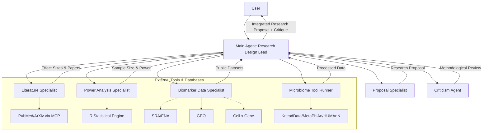

# Bioinformatics Research Design Agent

An AI agent that automates statistical power analysis and study design planning for pharmaceutical research and bioinformatics studies. Built with Google's Agent Development Kit (ADK) and R for statistical computations.

## The Pitch

### Problem Statement
Designing robust biomedical research studies is complex and error-prone. Researchers often struggle to:
1.  **Determine appropriate sample sizes**, leading to underpowered studies and wasted resources.
2.  **Navigate vast literature** to find relevant effect sizes and study parameters.
3.  **Integrate statistical rigor** into their initial study proposals.

### Solution
The **Bioinformatics Research Design Agent** is an intelligent orchestration system that acts as a virtual "Research Design Lead". It coordinates specialized sub-agents to automate the critical pre-clinical planning phase:
-   **Lead Agent**: Understands high-level research goals and orchestrates the workflow.
-   **Literature Specialist**: Scours PubMed/arXiv via MCP to find grounded parameters (effect sizes, variance).
-   **Power Analysis Specialist**: Uses R to perform rigorous statistical power calculations and simulations.

### Value Proposition
-   **Scientific Rigor**: Replaces "rule of thumb" guesses with calculation-backed study designs.
-   **Time Efficiency**: Reduces days of literature review and statistical coding to minutes.
-   **Reproducibility**: Generates code-backed analysis that can be audited and reproduced.

## Architecture



## Features

- **Statistical Power Analysis**: Calculate sample size, power, or effect size for various statistical tests
- **Simulation-Based Power Analysis**: Support for complex designs (mixed effects, clustered data, survival) via R simulations
- **Literature Search**: Search academic papers from arXiv, PubMed, bioRxiv, and other sources via MCP
- **Public Biomarker Data Access**: Search and retrieve data from SRA/ENA, GEO, and CZ Cell x Gene
- **Microbiome Pipeline Integration**: Run KneadData, MetaPhlAn2, and HUMAnN2 on sequencing data
- **Research Proposal Generation**: Automated synthesis of literature and power analysis into formal proposals
- **Methodological Criticism**: AI-powered review for statistical rigor, bias detection, and biomarker-specific issues
- **R Integration**: Leverages R's `pwr`, `lme4`, and `survival` packages for robust computations
- **Multi-Agent Architecture**: 6 specialized sub-agents orchestrated by a research design lead
- **Human-in-the-Loop**: Interactive feedback cycle for reviewing and adjusting parameters during proposal generation
- **MCP Integration**: Uses Model Context Protocol for seamless literature search capabilities

## Project Structure

```
research-design-agent/
├── main_agent.py                # Entry point and orchestration agent
├── power_analysis_agent.py      # Power analysis specialist
├── literature_agent.py          # Literature review specialist (MCP)
├── proposal_agent.py            # Research proposal synthesis specialist
├── biomarker_agent.py           # Public biomarker data specialist
├── criticism_agent.py           # Methodological critique specialist
├── microbiome_agent.py          # Microbiome pipeline tool runner
├── tools/
│   ├── __init__.py
│   ├── r_execution.py           # R script execution tool
│   └── simulation_tool.py       # Simulation-based power analysis
├── r_scripts/
│   ├── power_analysis.R         # Analytical power analysis
│   └── simulation_power.R       # Simulation-based power analysis
├── generated_scripts/           # Auto-generated R scripts (reproducibility)
├── output_dir/                  # Output directory for analysis results
├── test_*.py                    # Test files for various components
├── requirements.txt             # Python dependencies
├── DEPLOYMENT.md                # Deployment instructions
├── VIDEO_SCRIPT.md              # Video submission script
└── README.md                    # This file
```

## Installation

### Prerequisites
- Python 3.10+
- R 4.0+
- Google Cloud credentials or API key for Gemini models

### Setup

1. Install Python dependencies:
```bash
pip install -r requirements.txt
```

4. Install R packages:
```bash
Rscript -e "install.packages(c('pwr', 'argparser', 'lme4', 'simr', 'survival', 'parallel'), repos='http://cran.us.r-project.org')"
```

3. Set up Google Cloud credentials:
```bash
export GOOGLE_API_KEY="your-api-key"
# OR
export GOOGLE_APPLICATION_CREDENTIALS="/path/to/credentials.json"
```

## Usage

### Running the Agent

```bash
python3 main_agent.py
```

For deployment instructions (Docker/Cloud Run), see [DEPLOYMENT.md](DEPLOYMENT.md).

### Example Interactions

**Power Analysis:**
```
User: I need to calculate sample size for a clinical trial comparing two treatments. 
      I expect a medium effect size and want 80% power.

Agent: I'll help you with that power analysis. For a two-sample t-test with:
       - Effect size (Cohen's d): 0.5 (medium)
       - Power: 0.8
       - Significance level: 0.05 (default)
       
       You would need approximately 64 participants in each group (128 total).
```

**Simulation-Based Power Analysis:**
```
User: I'm designing a study with 3 time points per subject. 
      How many subjects do I need to detect a small effect (d=0.3) with 80% power?

Agent: This requires simulation-based power analysis due to repeated measures.
       [Runs simulation with mixed effects model]
       
       Based on 1000 simulations:
       - Sample size: 45 subjects
       - Estimated Power: 0.82 (82.0%)
```

**Literature Search:**
```
User: Find papers about effect sizes in diabetes drug trials.

Agent: I'll search PubMed for relevant papers on diabetes drug trials and effect sizes.
       [Searches using MCP tools]
       
       Here are some relevant papers:
       1. "Meta-analysis of GLP-1 agonists..." - Effect size: Cohen's d = 0.65
       2. "Systematic review of SGLT2 inhibitors..." - Mean difference: -0.8% HbA1c
       ...
```

### Testing

Run the test suite:
```bash
python3 test_r_tool.py           # Test R execution tool
python3 test_agent_flow.py       # Test power analysis agent
python3 test_literature_agent.py # Test literature search MCP integration
```

## Technical Details

### Power Analysis Tool

The `run_power_analysis` function accepts:
- `test_type`: Type of statistical test (t.test, correlation, proportion)
- `effect_size`: Cohen's d, r, or h depending on test type
- `n`: Sample size (leave None to calculate)
- `alpha`: Significance level (default: 0.05)
- `power`: Statistical power (default: 0.8, leave None to calculate)
- `alternative`: Hypothesis type (two.sided, less, greater)
- `type`: For t-tests: two.sample, one.sample, or paired

### R Integration

The agent uses subprocess-based R execution for:
- **Reliability**: Isolated R process prevents memory leaks
- **Flexibility**: Easy to extend with custom R scripts
- **Compatibility**: Works across platforms without rpy2 dependencies

## Future Enhancements

- [ ] Interactive visualization of power curves
- [ ] Integration with study design databases
- [ ] Export to study protocol templates (DOCX, LaTeX)
- [ ] Direct download and processing of SRA/GEO datasets
- [ ] Extended bioinformatics pipeline support (DESeq2, limma, edgeR)
- [ ] Cloud deployment with web interface

## License

Apache 2.0 - See LICENSE file

## Acknowledgments

Built for the Google Agents Intensive Capstone Project using the Agent Development Kit (ADK).
